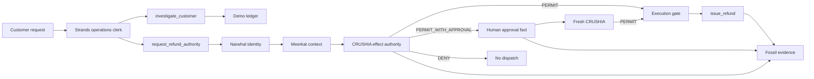

# Architecture

## Decision table (this demo)

| Case | Amount | Tenant | CRUSHIA | Dispatch |
|---|---|---|---|---|
| Maya duplicate seat | $20 | hood-ops | PERMIT | yes |
| Jordan duplicate contract | $750 | hood-ops | PERMIT_WITH_APPROVAL | no, until fresh PERMIT |
| Other Tenant LLC | $20 | foreign | DENY | no |

## Strands

The clerk is a `strands.Agent` with four tools. Tools never move money except
`execute_refund`, which can only run with a HIOP permit token.
