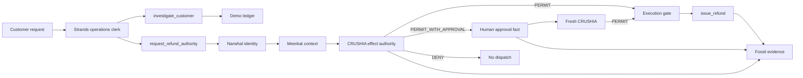

# Architecture

## Decision table (this demo)

| Case | Amount | Tenant | CRUSHIA | Dispatch |
|---|---|---|---|---|
| OTC wall sign | $20 | hood-ops | PERMIT | yes — issues NH-SGN-… |
| Commercial building BLD-2026-08441 | **$7,600** | hood-ops | PERMIT_WITH_APPROVAL | no, until building official + fresh PERMIT |
| Riverside Holdings | $7,600 | other-jurisdiction | DENY | no |

## Strands

The clerk is a `strands.Agent` with four tools. Tools never move money except
`execute_refund`, which can only run with a HIOP permit token.
